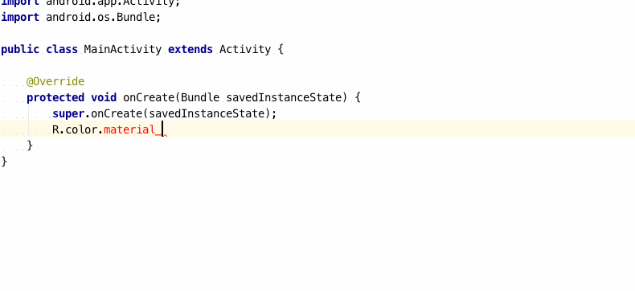
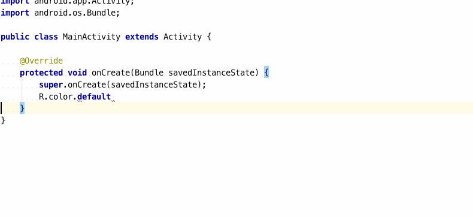

`Android-Material-Colors` is an color resource library for `Android`.

Demo
---

### MaterialColor


[Get the color of the MaterialDesign](https://www.google.com/design/spec/style/color.html)

### Android DefaultColor


[Get the Android standard of color](https://developer.android.com/intl/ja/reference/android/graphics/Color.html)

How do I use it?
---

### Setup

##### Dependencies
```groovy
dependencies {
    compile 'com.961neko:Android-Material-Colors:1.0.0'
}
```

License
-------

    Copyright 2016 961neko

    Licensed under the Apache License, Version 2.0 (the "License");
    you may not use this file except in compliance with the License.
    You may obtain a copy of the License at

       http://www.apache.org/licenses/LICENSE-2.0

    Unless required by applicable law or agreed to in writing, software
    distributed under the License is distributed on an "AS IS" BASIS,
    WITHOUT WARRANTIES OR CONDITIONS OF ANY KIND, either express or implied.
    See the License for the specific language governing permissions and
    limitations under the License.
